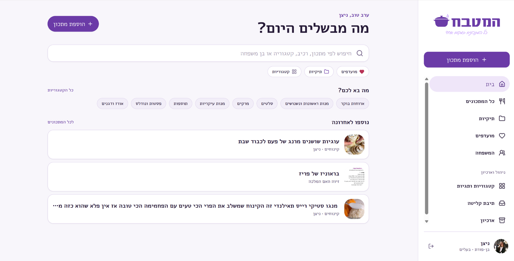
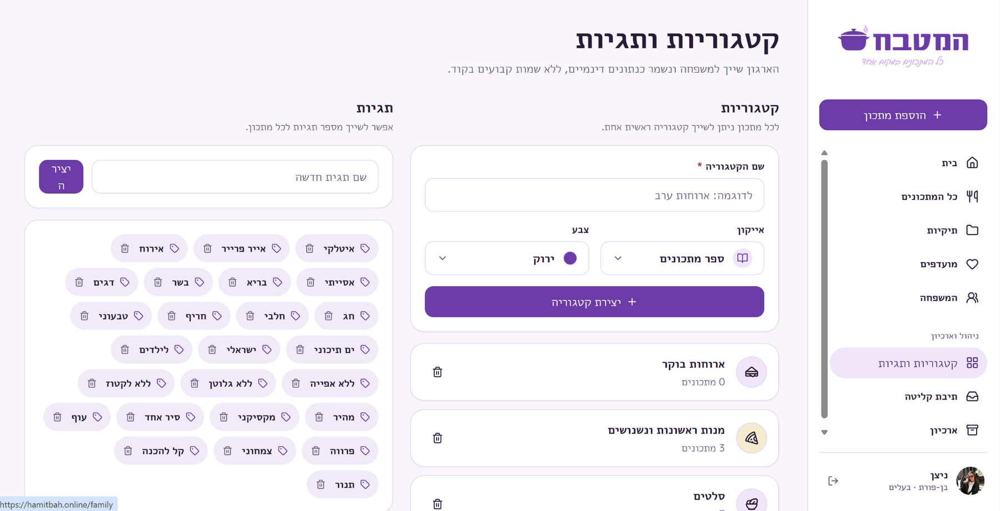
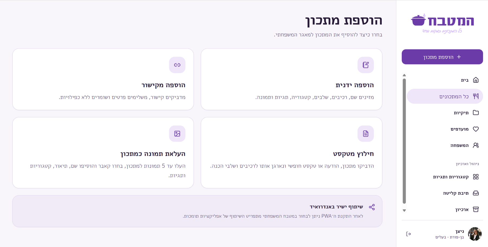
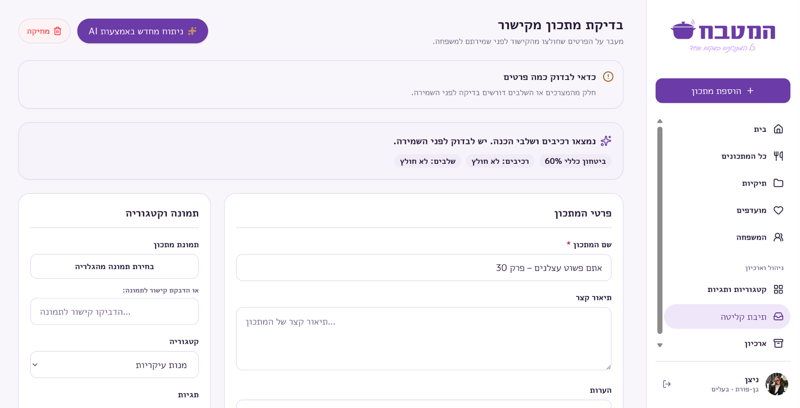
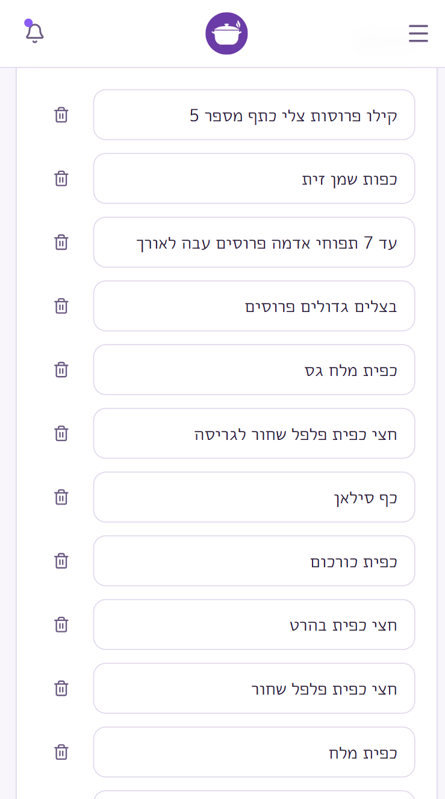
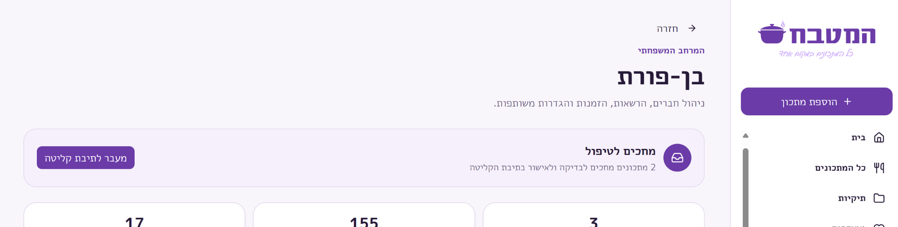

# Family Recipes Product Walkthrough

Family Recipes is a live, private family product built around a simple product goal: make family recipes easier to capture, organize, find, and maintain together.

The screenshots in this showcase use approved product views and intentionally avoid exposing private account details or identifiable family-member information.

## 1. Library home

The home experience is designed around retrieval rather than administration.

Users can quickly:

- search across the recipe library
- jump into categories
- access favorites and folders
- see recently added recipes
- start a new recipe capture flow

The product decision here is to make the library feel immediately useful even as the collection grows. Search and organization are visible from the first screen rather than hidden in secondary settings.

## 2. Family-managed taxonomy

Categories and tags are family-owned data, not hard-coded product content.

This supports two different organizational needs:

- categories provide the main structure of the recipe library
- tags capture flexible attributes such as cuisine, dietary preferences, holidays, or preparation style

The taxonomy can evolve with the family instead of forcing everyone into a fixed classification system.

## 3. Multiple capture paths

A central product principle is that recipes should be saved from the context in which they are discovered.

The app supports several intake paths:

- manual creation
- adding from a link
- pasting or sharing text
- uploading recipe images
- Android share-target intake through the installed PWA

These paths converge into a common review model so the product remains consistent after capture.

## 4. Gemini-assisted extraction with human review

Gemini is used through a server-side API workflow to help turn messy, unstructured inputs into a proposed recipe structure.

The AI can help identify fields such as:

- title
- ingredients
- preparation steps
- supporting metadata used in the review flow

The output is deliberately presented as a proposal, not as final truth. The user reviews and corrects the extracted content before saving it into the family library.

This human-in-the-loop decision reduces manual entry while keeping users in control when extraction is incomplete or uncertain.

For the deeper AI workflow, see [AI_RECIPE_INTAKE.md](AI_RECIPE_INTAKE.md).

## 5. Mobile-first recipe editing and use

Recipes are frequently viewed and edited from a phone, often while shopping or cooking.

The mobile experience therefore prioritizes:

- large readable recipe content
- simple ingredient editing
- clear touch targets
- Hebrew RTL behavior
- minimal navigation overhead

Mobile was treated as a primary product context rather than a compressed desktop layout.

## 6. Shared family workspace

The product is collaborative, but privacy matters because the live system contains real family accounts and content.

The production workspace supports family membership and role-based collaboration while the public portfolio screenshot is intentionally cropped to show only safe aggregate product context.

The role model stays deliberately compact:

- owner
- editor
- viewer

Server-side authorization and database RLS enforce access rather than relying only on UI visibility.

## Product principles demonstrated

Family Recipes is useful as a case study because several product decisions reinforce the same goal:

- reduce capture friction before asking users to organize
- keep AI assistance reviewable and reversible
- adapt information architecture to a growing shared library
- use simple roles for a non-enterprise collaboration model
- prioritize mobile contexts where recipes are actually discovered and used
- separate reversible archive behavior from permanent deletion
- keep private family data behind explicit authorization boundaries

The product remains actively maintained as a live family tool, while this repository contains only the material needed to explain the product and engineering decisions safely.
